# Mimari Manifesto — Real-Time Sales Analytics Platform

> Bu belge projenin mimari kararlarını, teknoloji seçimlerini ve tasarım prensiplerini açıklar.
> Her karar "neden bu?" sorusuna yanıt verir.

---

## İçindekiler

1. [Genel Bakış](#1-genel-bakış)
2. [Mimari Felsefesi](#2-mimari-felsefesi)
3. [Sistem Mimarisi](#3-sistem-mimarisi)
4. [Servis Bağımlılıkları ve Başlatma Sırası](#4-servis-bağımlılıkları-ve-başlatma-sırası)
5. [Event-Driven Akış — Sipariş Oluşturma](#5-event-driven-akış--sipariş-oluşturma)
6. [Veri Akışı ve Katmanlar](#6-veri-akışı-ve-katmanlar)
7. [Servis Detayları](#7-servis-detayları)
   - [API Gateway](#71-api-gateway)
   - [Order Service](#72-order-service)
   - [Product Service](#73-product-service)
   - [Analytics Service](#74-analytics-service)
   - [Frontend](#75-frontend)
8. [Altyapı Kararları](#8-altyapı-kararları)
9. [Tasarım Desenleri](#9-tasarım-desenleri)
10. [Trade-off'lar ve Bilinçli Kısıtlamalar](#10-trade-offlar-ve-bilinçli-kısıtlamalar)

---

## 1. Genel Bakış

Bu platform **gerçek zamanlı satış analitik** ihtiyacını karşılamak için tasarlanmış
**polyglot mikroservis** mimarisine sahiptir.

```
Kullanıcı sipariş verir
    → Anlık olarak stok güncellenir
    → Anlık olarak dashboard metrikleri güncellenir
    → Tüm eventler aranabilir şekilde indekslenir
```

**Temel hedefler:**
- Servisler birbirinden **bağımsız deploy** edilebilmeli
- Sipariş yazma, analitik okuma birbirini **bloke etmemeli**
- Sistem bileşenleri **farklı dillerde/framework'lerde** yazılabilmeli (polyglot)
- Tüm ortam **tek komutla** ayağa kalkmalı (`docker compose up`)

---

## 2. Mimari Felsefesi

### Neden Mikroservis?

```
Monolitik Alternatif:
┌─────────────────────────────────────┐
│  Tek uygulama: Order + Product      │
│  + Analytics + API + Frontend       │
│                                     │
│  ✗ Bir değişiklik tümünü deploy eder│
│  ✗ Analytics yükü order'ı etkiler   │
│  ✗ Tek dil/tek framework zorunlu    │
└─────────────────────────────────────┘

Mikroservis Yaklaşımı:
┌──────────┐  ┌──────────┐  ┌──────────┐
│  Order   │  │ Product  │  │Analytics │
│ Service  │  │ Service  │  │ Service  │
│ (.NET 8) │  │(Java 17) │  │ (.NET 8) │
└──────────┘  └──────────┘  └──────────┘
     ↑              ↑              ↑
✓ Bağımsız deploy  ✓ Bağımsız scale  ✓ Farklı dil
```

### Neden Event-Driven?

Alternatif: **Senkron HTTP zinciri**

```
Order Service ──HTTP──► Product Service ──HTTP──► Analytics Service
     ↑                        ↑                         ↑
✗ Product Service çökerse order başarısız olur
✗ Analytics gecikmesi order latency'sine eklenir
✗ Servisler sıkı bağlı (tight coupling)
```

Seçilen: **Asenkron Kafka event'leri**

```
Order Service ──Kafka──► Product Service  (bağımsız tüketir)
                  └────► Analytics Service (bağımsız tüketir)
     ↑
✓ Order Service sadece "event yayınla" der, kimsenin dinleyip dinlemediğini bilmez
✓ Product veya Analytics çökerse order etkilenmez
✓ Yeni servis eklemek için mevcut kodu değiştirmeye gerek yok
```

---

## 3. Sistem Mimarisi

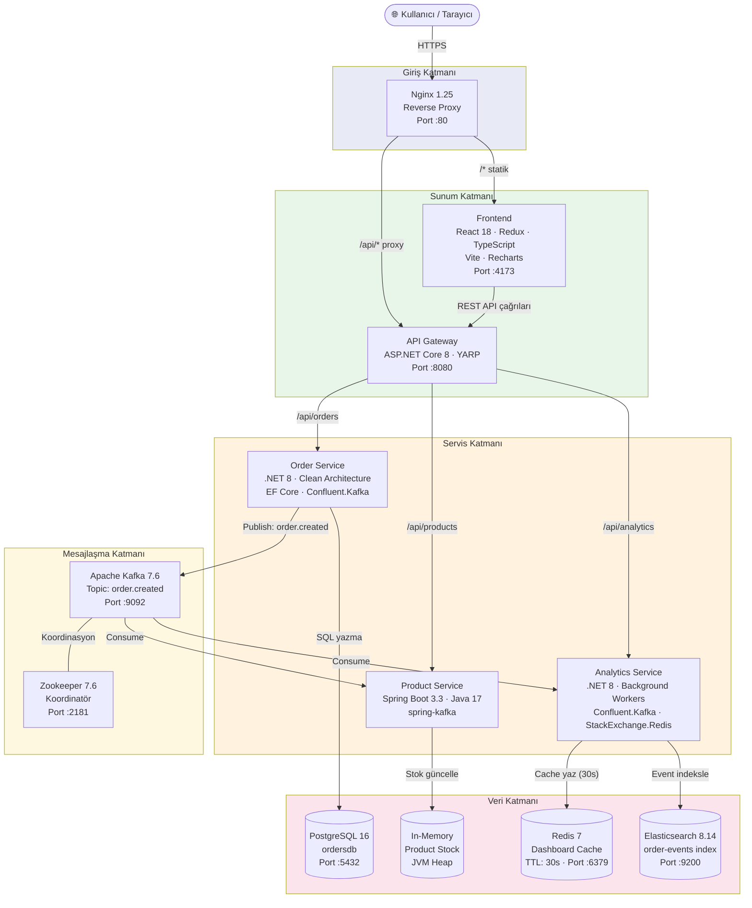

---

## 4. Servis Bağımlılıkları ve Başlatma Sırası

Docker Compose `depends_on` zinciri:

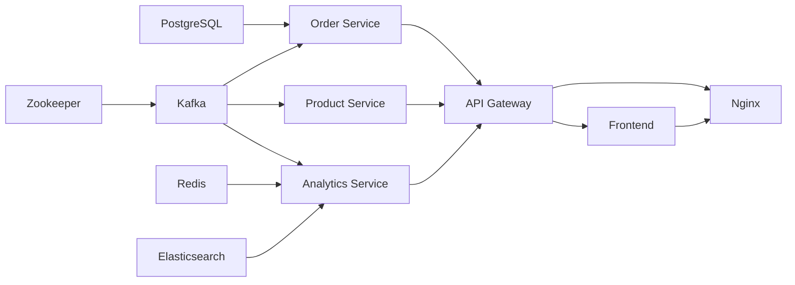

**Başlatma sırası (paralel gruplar):**

| Aşama | Servisler | Neden |
|-------|-----------|-------|
| 1 | Zookeeper, PostgreSQL, Redis, Elasticsearch | Bağımlısı yok |
| 2 | Kafka | Zookeeper hazır olmalı |
| 3 | Order, Product, Analytics Service | Kafka + kendi DB'leri hazır olmalı |
| 4 | API Gateway | Tüm backend servisler hazır olmalı |
| 5 | Frontend | Gateway hazır olmalı |
| 6 | Nginx | Hem Gateway hem Frontend hazır olmalı |

---

## 5. Event-Driven Akış — Sipariş Oluşturma

Bir siparişin sistemdeki tam yaşam döngüsü:

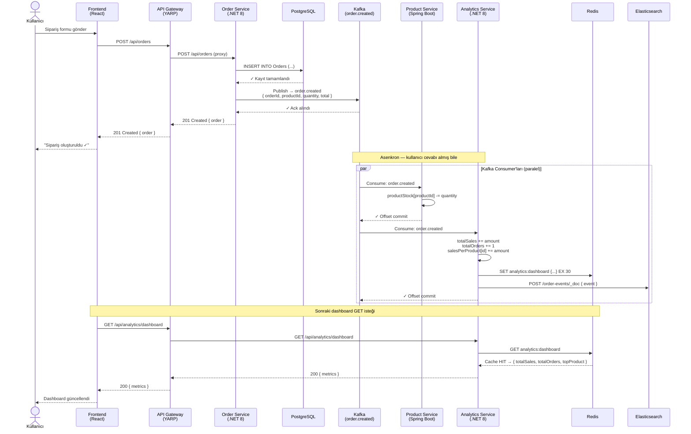

---

## 6. Veri Akışı ve Katmanlar

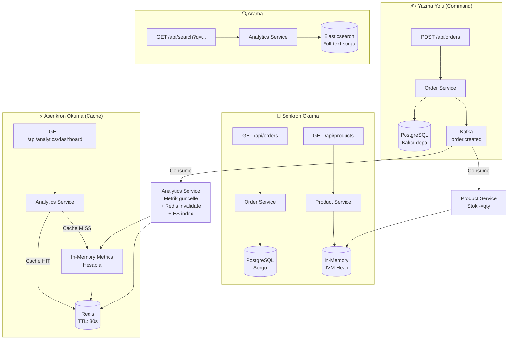

---

## 7. Servis Detayları

### 7.1 API Gateway

**Neden YARP (Yet Another Reverse Proxy)?**

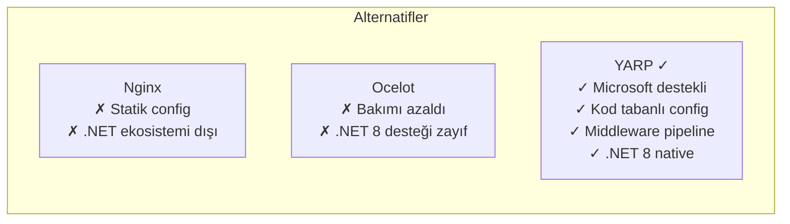

**Routing kuralları:**

```
İstek                       → Hedef Servis
/api/orders/**              → order-service:8080
/api/products/**            → product-service:8080
/api/analytics/**           → analytics-service:8080
```

**Gateway'in sorumluluğu YALNIZCA routing'dir** — auth, rate limiting gibi
cross-cutting concern'ler production'da buraya eklenecek şekilde tasarlanmıştır.

---

### 7.2 Order Service

**Clean Architecture katmanları:**

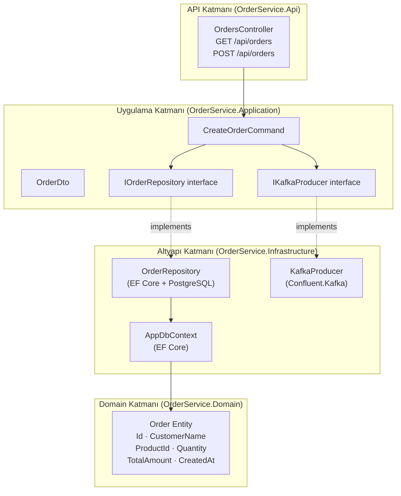

**Neden Clean Architecture?**
- `Application` katmanı `Infrastructure`'a **bağımlı değil** → test edilebilir
- `IOrderRepository` interface'i `PostgreSQL`'i mock'lamayı sağlar
- Domain logic, framework veya DB'den izole

**Neden PostgreSQL?**
- Sipariş verisi **ilişkisel** yapıya uygun (CustomerName, ProductId, Amount)
- ACID garantisi kritik: Sipariş ya tamamen yazılır ya hiç
- EF Core ile migration yönetimi kolay

---

### 7.3 Product Service

**Neden Spring Boot (Java) — .NET değil?**

```
Kasıtlı polyglot seçim:
✓ Farklı teknoloji yığınlarının birlikte çalışabileceğini göstermek
✓ Microservices'in dil bağımsızlığını somutlaştırmak
✓ Kafka consumer Spring ekosisteminde (spring-kafka) son derece olgun
```

**Neden In-Memory storage?**

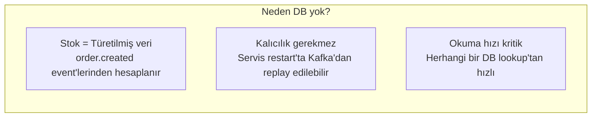

> **Kısıt:** Servis restart'ında stok sıfırlanır. Production'da
> Kafka'dan replay veya bir event store ile çözülür.

---

### 7.4 Analytics Service

**Neden iki farklı cache/search katmanı?**

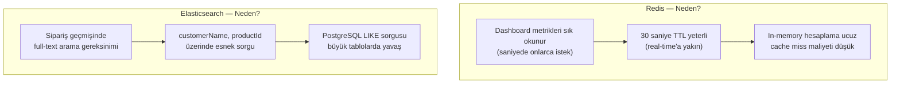

**Background Worker mimarisi:**

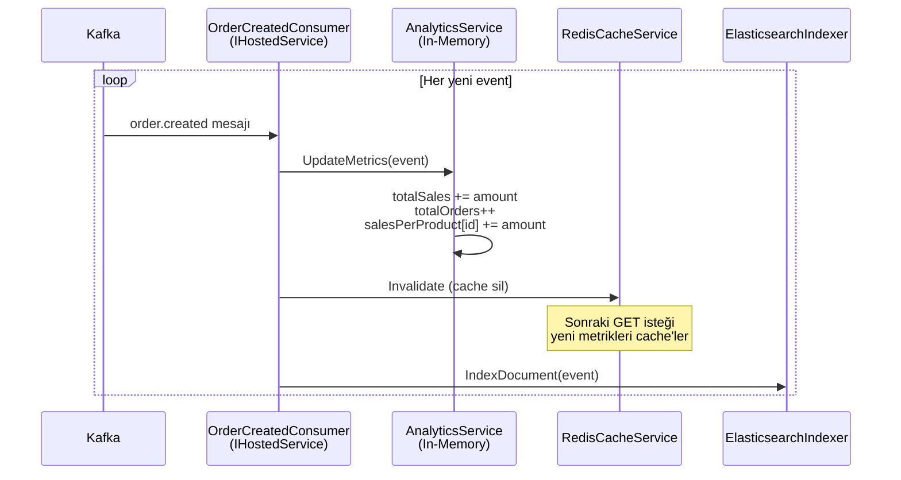

---

### 7.5 Frontend

**State yönetimi mimarisi:**

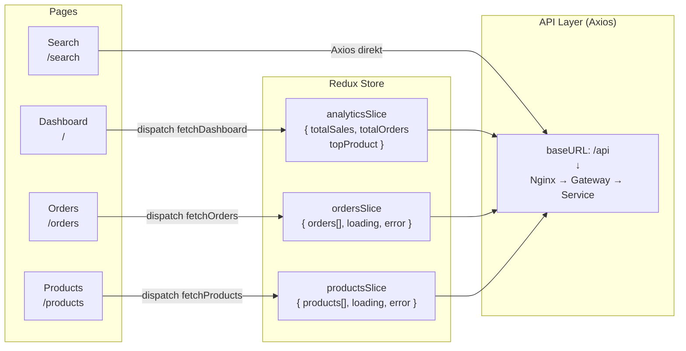

**Neden Redux Toolkit?**

- Birden fazla sayfa aynı veriyi kullanır (Dashboard + Orders)
- API durumu (loading/error) her component'te tekrar yazılmaz
- RTK'nın `createSlice` ile boilerplate minimumda

**Neden Vite (Webpack değil)?**

```
Geliştirme deneyimi:
Webpack: cold start ~8-15s, HMR ~2-5s
Vite:    cold start <1s,    HMR <100ms  ✓
```

---

## 8. Altyapı Kararları

### Nginx — Neden giriş noktası?

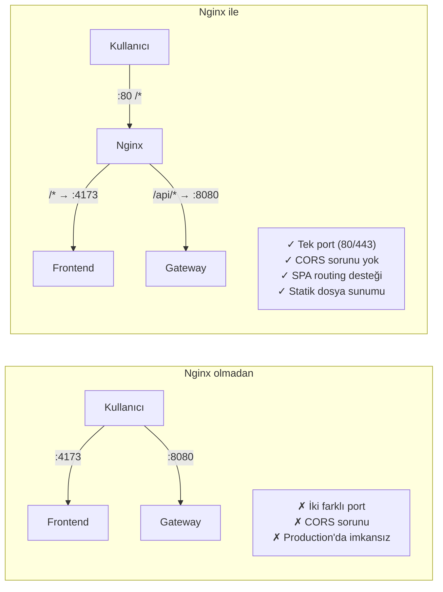

### Kafka — Neden diğer alternatiflere tercih edildi?

| Özellik | RabbitMQ | Redis Pub/Sub | **Kafka** |
|---------|----------|---------------|-----------|
| Mesaj kalıcılığı | ✓ | ✗ | **✓** |
| Replay (geçmiş okuma) | ✗ | ✗ | **✓** |
| Yüksek throughput | Orta | Yüksek | **Çok Yüksek** |
| Consumer group | ✓ | ✗ | **✓** |
| Analitik için uygunluk | Düşük | Düşük | **Yüksek** |

> **Kritik avantaj:** Kafka event'leri disk'e yazılır. Analytics Service yeniden başladığında
> geçmiş event'leri replay ederek in-memory metriklerini yeniden oluşturabilir.

### Redis Cache Stratejisi

```
Cache-Aside Pattern:
                     ┌──────────────┐
GET /analytics  ───► │   Redis      │──── HIT ──► Response
                     │ analytics:   │
                     │ dashboard    │──── MISS ──► In-Memory Hesapla
                     └──────────────┘                    │
                                                         ▼
order.created   ───► Cache Invalidate              SET Redis (30s)
```

**TTL = 30 saniye** seçimi:
- Real-time hissi verir (kullanıcı max 30s eski veri görür)
- Backend'e her istek için hesaplama yaptırmaz
- Yoğun dashboard kullanımında Redis baskıyı emer

---

## 9. Tasarım Desenleri

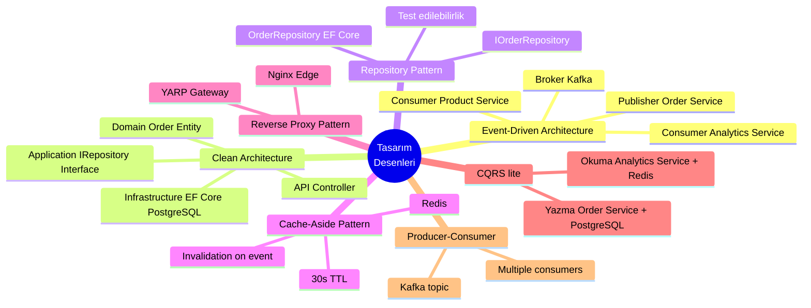

---

## 10. Trade-off'lar ve Bilinçli Kısıtlamalar

| Karar | Avantaj | Kabul Edilen Kısıt |
|-------|---------|-------------------|
| **Product Service in-memory** | Sıfır DB latency, sade kod | Restart'ta stok sıfırlanır |
| **Analytics in-memory metrics** | Hızlı hesaplama | Restart'ta Kafka replay gerekir |
| **Redis TTL=30s** | Cache baskısını düşürür | Max 30s gecikmiş veri |
| **Single Kafka broker** | Kurulumu basit | HA yok, single point of failure |
| **Elasticsearch security=false** | Geliştirme kolaylığı | Production'da TLS + auth şart |
| **Zookeeper based Kafka** | Sağlam, iyi belgelenmiş | KRaft moduna kıyasla ek servis |
| **EF Core migrations** | Kod tabanlı schema yönetimi | Migration çakışma riski (takımda) |

---

## Özet

```
Kullanıcı → Nginx → Gateway → Servisler
                                  │
                      ┌───────────┼───────────┐
                      ▼           ▼           ▼
                   Order       Product    Analytics
                  (.NET 8)   (Java 17)   (.NET 8)
                      │                      │
                   PostgreSQL              Redis
                      │                  Elasticsearch
                      └──── Kafka ───────────┘
                         (order.created)
```

Her servis **tek bir sorumluluğa** sahiptir.
Servisler **event üzerinden** haberleşir, doğrudan birbirini çağırmaz.
Okuma ve yazma yolları **birbirini bloke etmez**.
Tüm sistem **docker compose up** ile ayağa kalkar.
